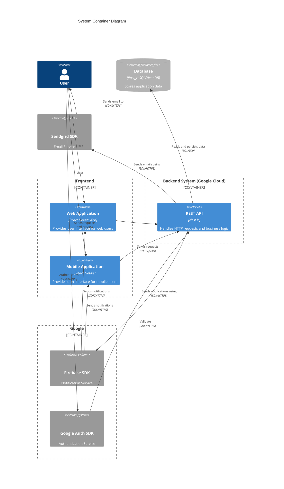
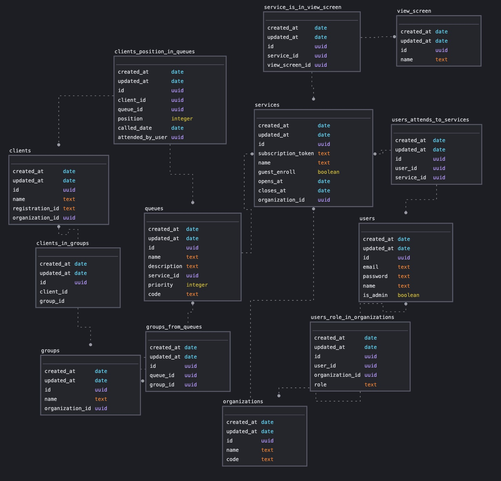

# Sisfila2

## Summary

Sisfila2 is a real-world queue management application and the foundation of my undergraduate thesis. Although it is a generic queue system, the application was developed with a focus on enrollment in the Institute of Computing in mind.

I was in charge of the development of this NestJS application, which was integrated with a React Native application developed by another graduation student.

## Architecture

### Container Diagram



## Configuração inicial

```bash
## não necessário caso o banco e a aplicação sejam inicializadas pelo docker-compose

## algumas variáveis do .env podem precisar de modificação

## preencha o arquivo serviceAccountKey.json com as credenciais do firebase

cp .env.example .env
cp .env.test.example .env.test
npm ci
touch serviceAccountKey.json
```

## Subir ambiente de desenvolvimento

```bash
docker-compose up --build
```

ou

```bash
docker-compose up db
npm run start:dev
```

## Documentação swagger

<http:localhost:3000/docs>

## Teste

```bash
# all tests
$ npm run test

# unit tests
$ npm run test:unit

# integration tests
$ npm run test:integration

# test coverage
$ npm run test:cov
```


