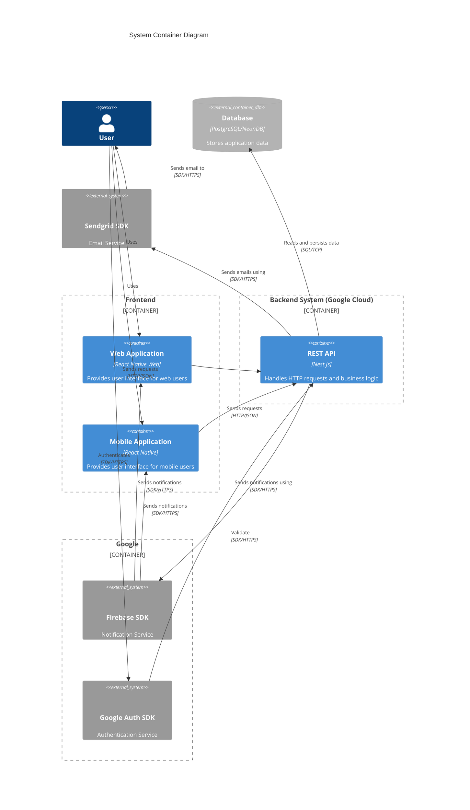
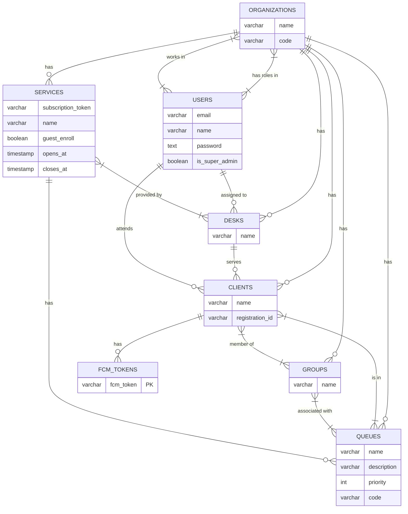
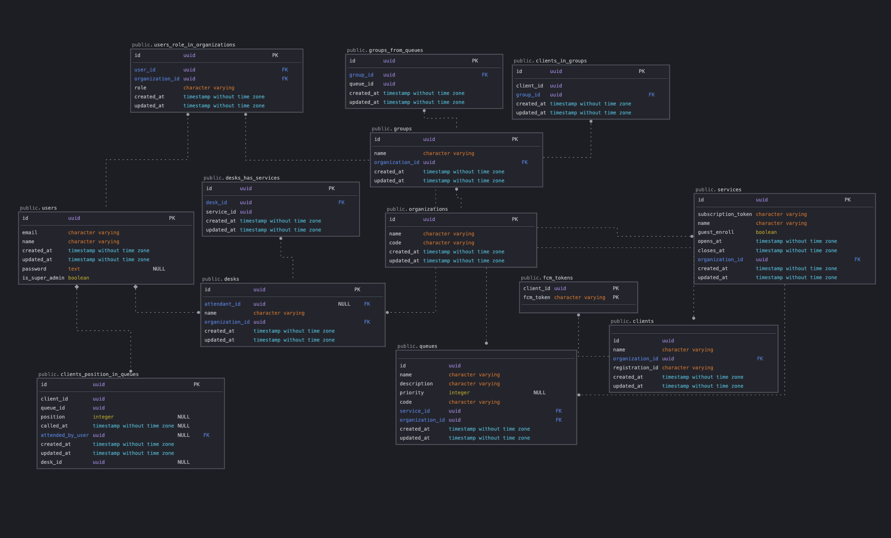

# Sisfila2

## Summary

Sisfila2 is a real-world queue management application and the foundation of my undergraduate thesis. Although it is a generic queue system, the application was developed with a focus on enrollment in the Institute of Computing in mind.

I was in charge of the development of this NestJS application, which was integrated with a React Native application developed by another graduation student.

## Architecture

### Container Diagram



## Initial setup

```bash
## not necessary if the database and the application are initialized by docker-compose
## some variables in the .env may need modification
## fill in the serviceAccountKey.json file with the firebase credentials

cp .env.example .env
cp .env.test.example .env.test
npm ci
touch serviceAccountKey.json
```

## Start development environment

```bash
## to start the database and the application
docker-compose up --build
```

ou

```bash
## to start only the database and run the application manually
docker-compose up db
npm run start:dev
```

## Swagger Docs

<http:localhost:3000/docs>

## Running the tests

```bash
# all tests
$ npm run test

# unit tests
$ npm run test:unit

# integration tests
$ npm run test:integration

# test coverage
$ npm run test:cov
```

## Database

### Entity Relationship Diagram



### Relational Database Model


